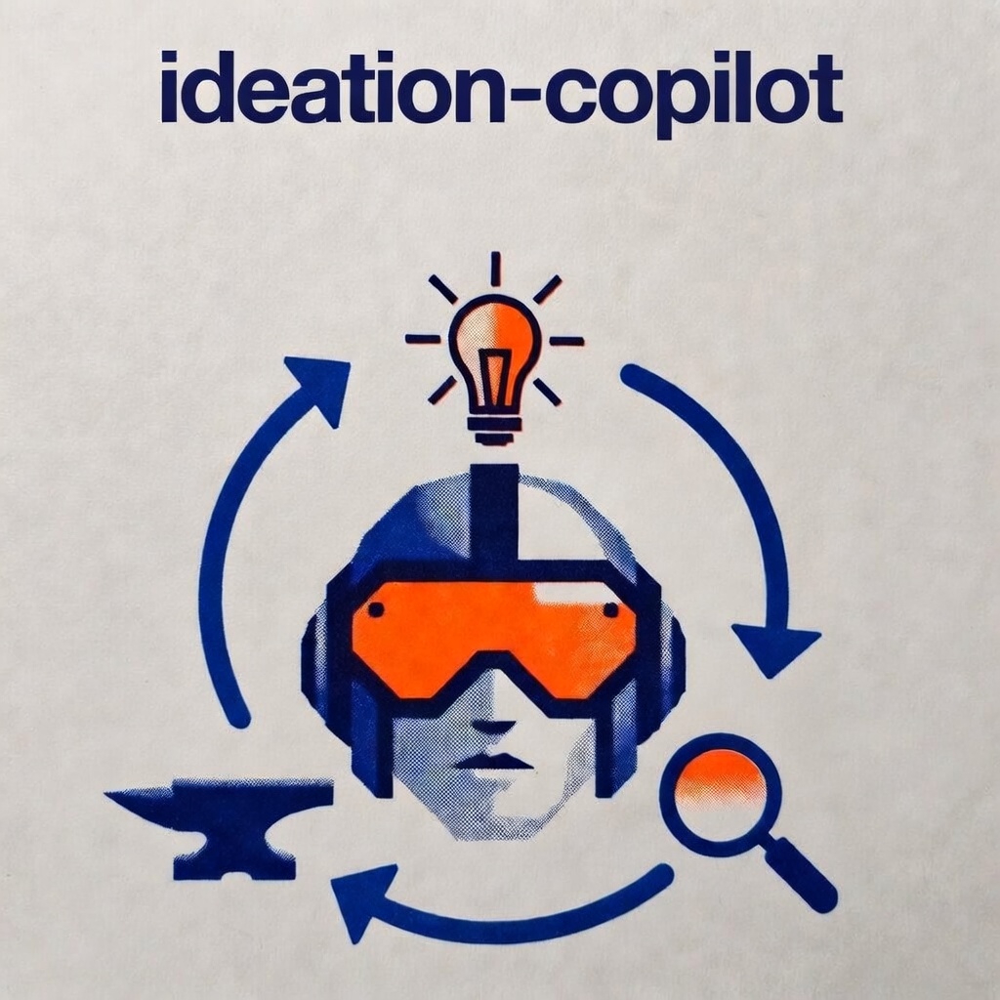

# Ideation Copilot

A structured repo for developing disruptive business ideas — from raw spark to validated concept.

<p align="center">
  
</p>

## Workflow

```
/idea:new → /idea:challenge → /idea:forge → repeat
```

| Command                          | What it does                                                                                                        |
| -------------------------------- | ------------------------------------------------------------------------------------------------------------------- |
| `/idea:new [name "description"]` | Scaffold a new idea with 6 structured docs                                                                          |
| `/idea:challenge [idea-name]`    | Stress-test across 7 lenses (problem, customer, market, competition, business model, execution, hidden assumptions) |
| `/idea:forge [idea-name]`        | Integrate challenge results, new data, and experiment outcomes back into the docs                                   |

## Idea Structure

Each idea lives in `ideas/YYYY-MM-DD-idea-name/` with:

| File                 | Purpose                                                   |
| -------------------- | --------------------------------------------------------- |
| `00-overview.md`     | Problem, insight, solution, target customer               |
| `01-brainstorm.md`   | Problem/solution space exploration                        |
| `02-lean-canvas.md`  | Lean Canvas with UVP, channels, revenue, costs            |
| `03-assumptions.md`  | Hidden assumptions ranked by risk, with evidence tracking |
| `04-pmf-strategy.md` | PMF ladder, go-to-market, milestones                      |
| `05-experiments.md`  | Experiment backlog, results, pivot/persevere criteria     |

## Installed Skills

Community skills powering the workflow:

- **lean-startup** — Build-Measure-Learn methodology
- **brainstorm-ideas-new** — Structured PM/Designer/Engineer ideation
- **lean-canvas** — Lean Canvas generation
- **pmf-strategy** — PMF validation framework
- **product-management** — Founder-PM toolkit

## Installation

### Claude Code

```bash
# Add the marketplace
/plugin marketplace add kaminskypavel/ideation-copilot

# Install the plugin
/plugin install ideation-copilot@ideation-copilot
```

### Codex

```bash
codex install github:kaminskypavel/ideation-copilot
```

## Getting Started

```bash
# Create your first idea
/idea:new smart-spin "AI-powered spinning bike that adapts resistance to your fitness goals"

# Challenge it
/idea:challenge smart-spin

# Integrate findings
/idea:forge smart-spin
```
