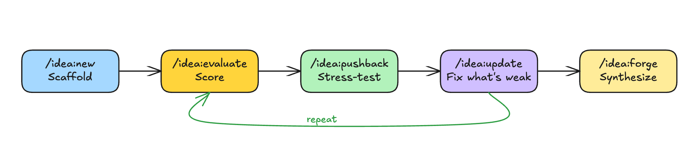

# Ideation Copilot

Turn a raw idea into a validated, investor-ready concept — using AI agents that research, score, and stress-test your thinking.

<p align="center">
  
</p>

## Installation

```bash
/plugin marketplace add kaminskypavel/ideation-copilot
/plugin install ideation-copilot@ideation-copilot
```

## How It Works

You start with an idea. The copilot guides you through a loop of testing, scoring, and improving until the idea is solid — or killed. Each command tells you what to do next.

<p align="center">
  
</p>

| Command                                       | Purpose                                                    |
| --------------------------------------------- | ---------------------------------------------------------- |
| `/idea:new [name "description"]`              | Scaffold a new idea with 6 structured docs                 |
| `/idea:evaluate [idea-name] [vc\|market\|yc]` | Score with parallel agents (all by default, or pick one)   |
| `/idea:pushback [idea-name]`                  | Conversational stress-test with web research               |
| `/idea:update [idea-name]`                    | Add new info to your docs (interviews, data, team changes) |
| `/idea:forge [idea-name]`                     | Synthesize everything into a consolidated summary          |
| `/idea:postmortem [idea-name]`                | Structured debrief when you kill an idea                   |
| `/idea:setup`                                 | Check & configure optional integrations (Exa, etc.)        |

### Step 1: Pitch your idea

```bash
/idea:new pawguard "Smart collar that detects early signs of illness in dogs using biometrics"
```

Scaffolds 6 structured docs (overview, brainstorm, lean canvas, assumptions, PMF strategy, experiments). You fill in what you know.

### Step 2: Get scored

```bash
/idea:evaluate pawguard
```

Three AI agents run **in parallel**, each researching and scoring your idea from a different angle:

| Agent              | What it asks             | Dimensions                                                                                            |
| ------------------ | ------------------------ | ----------------------------------------------------------------------------------------------------- |
| **VC**             | "Is this investable?"    | Team, Timing, TAM, Technology, Moat, Business Model, GTM, Traction                                    |
| **Market Analyst** | "Is the market real?"    | Market Size, Competitive Landscape, Timing & Tailwinds, Customer Access, Regulatory Risk              |
| **YC Founder-Fit** | "Should YOU start this?" | Problem Acuteness, Personal Demand, Successful Proxies, Commitment, Scalability, Idea Space Fertility |

You get a combined score (0-100), deal-breakers flagged, and the single weakest dimension to fix first. Agents use web research — they'll check your TAM claims, find your competitors, and validate your timing.

Run a single agent: `/idea:evaluate pawguard vc` or `market` or `yc`

### Step 3: Stress-test through dialogue

```bash
/idea:pushback pawguard
```

An adversarial sparring partner breaks your idea into testable claims and challenges each one. You defend, clarify, or concede. It uses named reasoning tools (inversion, base rate analysis, pre-mortem) and web research to back up its challenges.

This isn't a lecture — it's a conversation. You'll discover blind spots you didn't know you had.

### Step 4: Fix what's weak

```bash
/idea:update pawguard
```

Low scores often mean your docs are incomplete, not that the idea is bad. Add what's missing — your team background, customer interview results, experiment outcomes, market data.

### Step 5: Repeat, then synthesize

Run evaluate and pushback again. Your scores should improve. Keep iterating until you're confident — or until the evidence tells you to pivot.

When you're ready, forge synthesizes everything — score trajectory over time, what's validated vs still assumed, key pivots, and a pitch-ready summary:

```bash
/idea:forge pawguard
```

## What's In an Idea Folder

Each idea lives in `ideas/YYYY-MM-DD-idea-name/`:

**You write these:**

| File                 | What goes in it                                        |
| -------------------- | ------------------------------------------------------ |
| `00-overview.md`     | Problem, insight, solution, target customer            |
| `01-brainstorm.md`   | Problem/solution space exploration                     |
| `02-lean-canvas.md`  | Lean Canvas — UVP, channels, revenue, costs            |
| `03-assumptions.md`  | Riskiest assumptions ranked, with evidence tracking    |
| `04-pmf-strategy.md` | PMF ladder, go-to-market, milestones                   |
| `05-experiments.md`  | Experiment backlog, results, pivot/persevere decisions |

**The copilot creates these:**

| File                        | What it contains                                        |
| --------------------------- | ------------------------------------------------------- |
| `evaluation-*.md`           | Scored reports with YAML frontmatter (machine-readable) |
| `pushback-session-*.md`     | Sparring scorecards with claim verdicts                 |
| `pushback-predictions-*.md` | Falsifiable, time-bound predictions                     |
| `forge-*.md`                | Consolidated synthesis with score trajectory            |

## Enhanced Research (Optional)

The copilot works out of the box with built-in web search. For richer market and competitor research, you can optionally add [Exa](https://exa.ai) — an AI-optimized search engine with category-specific results (company databases, financial reports, news, research papers, LinkedIn profiles).

### Quick setup

**1. Get an Exa API key** at [exa.ai](https://exa.ai) (free tier: 1,000 requests/month).

**2. Add the key to your Claude Code settings** (`~/.claude/settings.json`):

```json
{
  "env": {
    "EXA_API_KEY": "your-key-here"
  }
}
```

**3. Run the setup command:**

```bash
/idea:setup
```

This detects your API key and auto-configures the Exa MCP server. **Restart your Claude Code session** after setup for the changes to take effect.

**4. Verify** by running `/idea:setup` again — Exa should show as **Configured**.

### What changes with Exa

| Without Exa | With Exa |
|-------------|----------|
| Generic web search for all research | Category-specific search: `company`, `news`, `financial report`, `research paper`, `linkedin profile` |
| Works fine — this is the default | More targeted competitor data, funding info, SEC filings, trend analysis |

Agents automatically use the right tool for each query — Exa when a category matches, web search for everything else. If Exa is ever unavailable, agents fall back to web search with zero disruption.

## Built With

Community skills powering the workflow:

- **lean-startup** — Build-Measure-Learn methodology
- **lean-canvas** — Lean Canvas generation
- **pmf-strategy** — PMF validation framework
- **product-management** — Founder-PM toolkit
- **brainstorm-ideas-new** — PM/Designer/Engineer ideation

