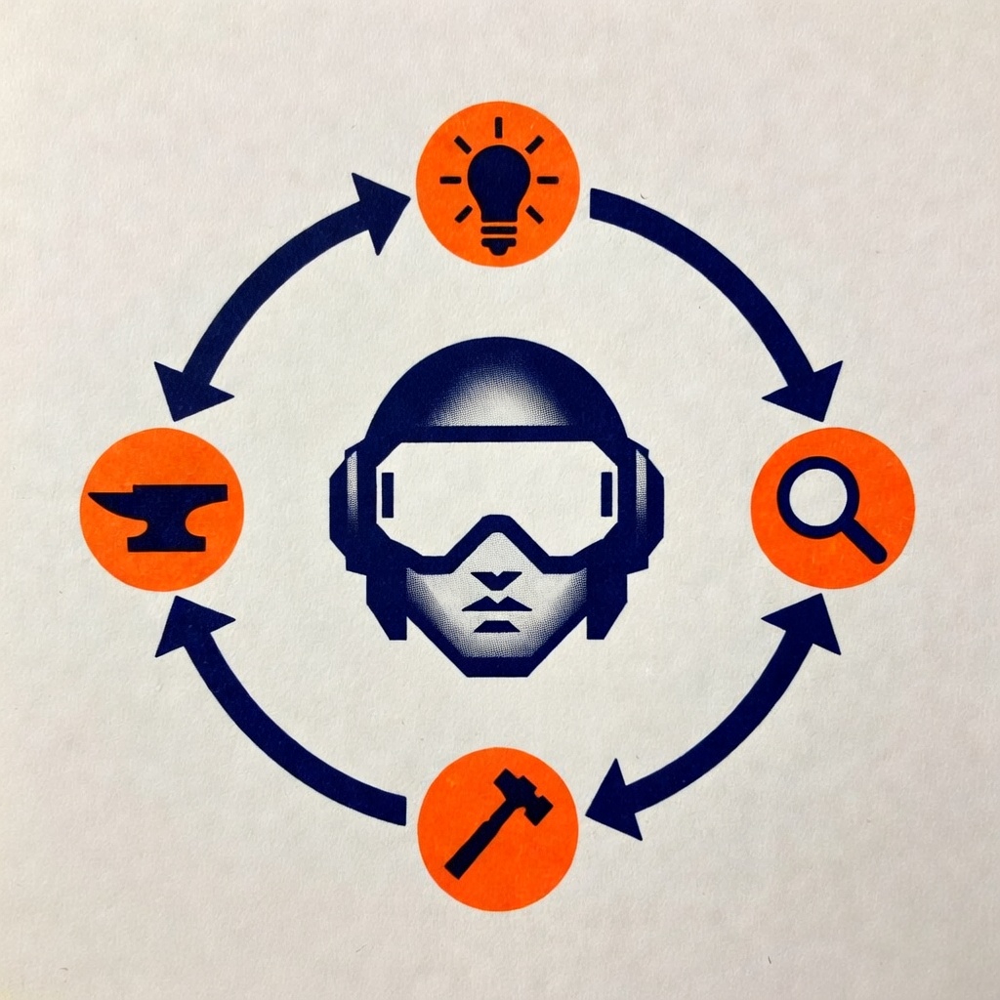

# Ideation Copilot

A structured repo for developing disruptive business ideas — from raw spark to validated concept.

<p align="center">
  
</p>

## Workflow

```
/idea:new → /idea:pushback → /idea:evaluate → /idea:update → (repeat) → /idea:forge
              (stress-test)    (score)          (add info)                  (synthesize)
```

| Command | What it does |
| --- | --- |
| `/idea:new [name "description"]` | Scaffold a new idea with 6 structured docs |
| `/idea:pushback [idea-name]` | Conversational stress-test — challenges claims through dialogue with web research |
| `/idea:evaluate [idea-name]` | Score the idea across VC investability and market opportunity using parallel agents |
| `/idea:update [idea-name]` | Add new info to docs — interviews, experiments, team details, market data |
| `/idea:forge [idea-name]` | Synthesize everything into a consolidated summary with score trajectory |

Each command hints at what to do next, so you always know the next step.

### Evaluation Agents

`/idea:evaluate` dispatches three agents in parallel:

| Agent | Dimensions | What it scores |
| --- | --- | --- |
| **VC** | 8 (weighted) | Team, Timing, TAM, Technology, Competition/Moat, Business Model, GTM, Traction |
| **Market Analyst** | 5 | Market Size & Growth, Competitive Landscape, Timing & Tailwinds, Customer Accessibility, Regulatory Risk |
| **YC Founder-Fit** | 10 | Founder-Market Fit, Market Size, Problem Acuteness, Competition Presence, Personal Demand, Recent Possibility, Successful Proxies, Long-term Commitment, Scalability, Idea Space Fertility |

Run a single agent: `/idea:evaluate my-idea vc` or `market` or `yc`

## Idea Structure

Each idea lives in `ideas/YYYY-MM-DD-idea-name/` with:

| File | Purpose |
| --- | --- |
| `00-overview.md` | Problem, insight, solution, target customer |
| `01-brainstorm.md` | Problem/solution space exploration |
| `02-lean-canvas.md` | Lean Canvas with UVP, channels, revenue, costs |
| `03-assumptions.md` | Hidden assumptions ranked by risk, with evidence tracking |
| `04-pmf-strategy.md` | PMF ladder, go-to-market, milestones |
| `05-experiments.md` | Experiment backlog, results, pivot/persevere criteria |

Session artifacts (created automatically):
- `pushback-session-*.md` — sparring scorecards
- `pushback-predictions-*.md` — falsifiable predictions
- `evaluation-*.md` — scored reports with YAML frontmatter
- `forge-*.md` — consolidated synthesis summaries

## Installed Skills

Community skills powering the workflow:

- **lean-startup** — Build-Measure-Learn methodology
- **brainstorm-ideas-new** — Structured PM/Designer/Engineer ideation
- **lean-canvas** — Lean Canvas generation
- **pmf-strategy** — PMF validation framework
- **product-management** — Founder-PM toolkit

## Installation

### Claude Code

```bash
# Add the marketplace
/plugin marketplace add kaminskypavel/ideation-copilot

# Install the plugin
/plugin install ideation-copilot@ideation-copilot
```

### Codex

```bash
codex install github:kaminskypavel/ideation-copilot
```

## Getting Started

```bash
# Create your first idea
/idea:new smart-spin "AI-powered spinning bike that adapts resistance to your fitness goals"

# Stress-test it
/idea:pushback smart-spin

# Score it
/idea:evaluate smart-spin

# Add new info (e.g., after customer interviews)
/idea:update smart-spin

# Synthesize everything after multiple rounds
/idea:forge smart-spin
```
