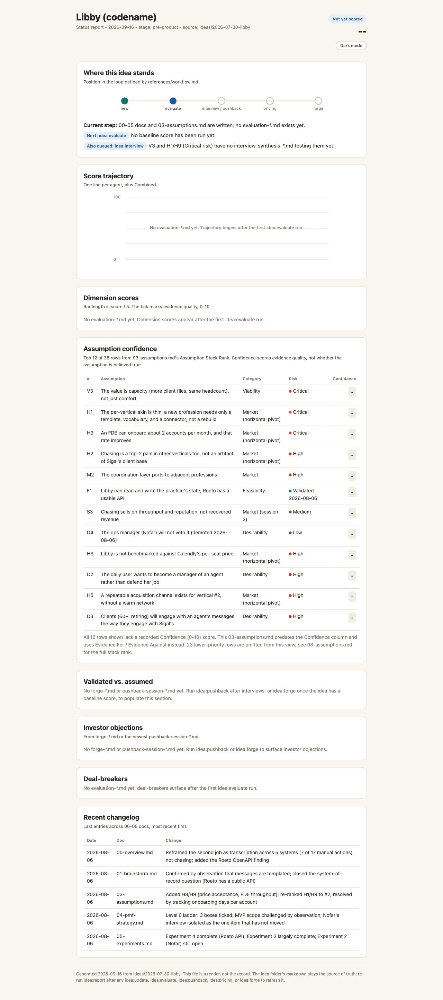

<p align="center">
  
</p>

<p align="center"><em>Turn a raw idea into a validated, investor-ready concept.</em></p>

<p align="center">
  
  
</p>

---

You start with an idea. The copilot guides a loop of testing, scoring, and improving until the idea is solid — or killed.

<p align="center">
  
</p>

## Install

Active next session.

<h3>
  
  Claude Code
</h3>

```bash
claude plugin marketplace add kaminskypavel/ideation-copilot
claude plugin install ideation-copilot@ideation-copilot
```

Then `/idea:new`, `/idea:evaluate`, `/idea:pushback`, …

<h3>
  
  Codex
</h3>

```bash
codex plugin marketplace add kaminskypavel/ideation-copilot
codex plugin add ideation-copilot@ideation-copilot
```

Prefix is `@`, not `/` — `@idea:new`.

<h3>
  
  Pi
</h3>

```bash
pi install git:github.com/kaminskypavel/ideation-copilot
```

`/skill:idea-new` or just ask. Skills load from the package; no extra config.

<h3>
  
  Anything else
</h3>

Drop the folders in [`plugins/ideation-copilot/skills/`](plugins/ideation-copilot/skills/) into the harness skills dir. One `SKILL.md` each, no moving parts.

## Commands

| Command | Purpose |
|---|---|
| `idea:new [name "description"]` | Scaffold a new idea with 6 structured docs |
| `idea:evaluate [idea-name] [vc\|market\|yc]` | Score with parallel agents (all by default, or pick one) |
| `idea:pushback [idea-name]` | Conversational stress-test with web research |
| `idea:update [idea-name]` | Add new info to your docs (interviews, data, team changes) |
| `idea:pricing [idea-name]` | Work out a value metric, willingness-to-pay signal, and packaging tiers |
| `idea:interview [idea-name]` | Generate a targeted customer interview guide and synthesize results |
| `idea:forge [idea-name]` | Synthesize everything into a consolidated summary |
| `idea:report [idea-name]` | Render a single-file HTML status report with inline charts |
| `idea:postmortem [idea-name]` | Structured debrief when you kill an idea |
| `idea:setup` | Check & configure optional integrations (Exa, etc.) |

## The Loop

One idea, one folder, one loop. Every command ends by reading the folder state and telling you the step the idea actually needs next (rules live in [`references/workflow.md`](plugins/ideation-copilot/references/workflow.md)).

```
idea:new
   |
   v
idea:evaluate   baseline score, expect Fair or below
   |
   v
idea:interview  ->  talk to 7-14 people  ->  idea:update
   |                                             |
   v                                             v
idea:pushback   challenge the weakest dimension  idea:evaluate  re-score
   |
   +-> repeat interview / update / pushback / evaluate until Good or better
   |
   v
idea:pricing    once demand signal is real
   |
   v
idea:forge      pitch-ready synthesis       idea:postmortem  if the evidence says stop
   |
   v
idea:report     shareable HTML status render
```

### Step 1: Pitch your idea

```bash
idea:new pawguard "Smart collar that detects early signs of illness in dogs using biometrics"
```

Scaffolds 6 structured docs (overview, brainstorm, lean canvas, assumptions, PMF strategy, experiments). You fill in what you know. Every assumption gets a Confidence (0-10) score; that number is the progress bar for the rest of the loop.

### Step 2: Baseline score

```bash
idea:evaluate pawguard
```

Three agents run **in parallel** when the harness can (Claude Agent tool, Pi subagents); otherwise sequential in-session. Same scoring either way.

| Agent | What it asks | Dimensions |
|---|---|---|
| **VC** | "Is this investable?" | Team, Timing, TAM, Technology, Moat, Business Model, GTM, Traction |
| **Market Analyst** | "Is the market real?" | Market Size, Competitive Landscape, Timing & Tailwinds, Customer Access, Regulatory Risk |
| **YC Founder-Fit** | "Should YOU start this?" | Problem Acuteness, Personal Demand, Successful Proxies, Commitment, Scalability, Idea Space Fertility |

Combined score (0-100) with a grade label (Not Ready to Exceptional), stage calibration (pre-product, prototype, early-revenue), evidence quality per dimension, deal-breakers flagged, weakest dimension first. Agents use web research for TAM, competitors, timing.

Single agent: `idea:evaluate pawguard vc` or `market` or `yc`

### Step 3: Talk to customers

```bash
idea:interview pawguard
```

Picks the riskiest low-confidence assumption, writes a neutral interview guide aimed at it (question, rationale, follow-up, what not to ask), and a recruiting plan. After the interviews, run it again with your notes: it classifies each quote as strong pull, polite, or demonstrated behavior, and writes a verdict with a new confidence score.

### Step 4: Fold in what you learned

```bash
idea:update pawguard
```

Interview syntheses, experiment results, pricing tests, team changes. Every real-world input goes here first, the same day. Low scores usually mean incomplete docs, not a bad idea.

### Step 5: Stress-test through dialogue

```bash
idea:pushback pawguard
```

An adversarial sparring partner breaks the idea into testable claims and challenges each one, starting with the weakest dimension. Tarpit check first, then named reasoning tools (inversion, base rate, pre-mortem, graveyard research) plus web research. Do this after interviews, not before: pushback without customer quotes is opinion against opinion.

### Step 6: Repeat, then price, then synthesize

Re-score only after the docs changed. Keep looping interview, update, pushback, evaluate until the label reads Good or better, or the kill criteria in `05-experiments.md` are hit.

```bash
idea:pricing pawguard
```

Value metric, willingness-to-pay method, packaging tiers, and the pricing study to run next. Do this before forge: Business Model cannot score well without it.

```bash
idea:forge pawguard
```

Score trajectory, validated vs still assumed, investor objections, 12-slide pitch order. This is what you hand to an advisor or investor, never the raw folder.

```bash
idea:report pawguard
```

Renders `forge`, the evaluations, and the assumptions into one self-contained HTML file: score trajectory, dimension bars, and an assumption confidence heatmap, all inline SVG, no dependencies, light and dark themes. Forge before you show anyone; report is what you actually hand them, or print.

<p align="center">
  
</p>

See [`docs/readme/report-sample.html`](docs/readme/report-sample.html) for the live, worked example (open it in a browser).

```bash
idea:postmortem pawguard
```

When the evidence says stop. Challenges revisionist history with the evaluations and pushback records, and extracts lessons for the next idea.

### Best practice

1. Baseline first, then evidence. A low first score is a map, not a verdict.
2. Interview before you argue.
3. Update the same day you learn something.
4. Re-score only after the docs changed; scoring the same docs twice measures noise.
5. One assumption per cycle.
6. Price before you forge.
7. Write kill criteria before you need them.
8. Forge before you show anyone; then report is the shareable render of forge.

## What's In an Idea Folder

Each idea lives in `ideas/YYYY-MM-DD-idea-name/`:

**You write these:**

| File | What goes in it |
|---|---|
| `00-overview.md` | Problem, insight, solution, target customer |
| `01-brainstorm.md` | Problem/solution space exploration |
| `02-lean-canvas.md` | Lean Canvas — UVP, channels, revenue, costs |
| `03-assumptions.md` | Riskiest assumptions ranked, with evidence tracking |
| `04-pmf-strategy.md` | PMF ladder, go-to-market, milestones |
| `05-experiments.md` | Experiment backlog, results, pivot/persevere decisions |

**The copilot creates these:**

| File | What it contains |
|---|---|
| `evaluation-*.md` | Scored reports with YAML frontmatter (machine-readable) |
| `pushback-session-*.md` | Sparring scorecards with claim verdicts |
| `pushback-predictions-*.md` | Falsifiable, time-bound predictions |
| `forge-*.md` | Consolidated synthesis with score trajectory |
| `interview-guide-*.md` | Interview guide targeting one assumption, plus recruiting plan |
| `interview-synthesis-*.md` | Classified quotes and an assumption verdict with new confidence |
| `pricing-*.md` | Value metric, price hypothesis, and the willingness-to-pay study to run |
| `report-*.html` | Single-file HTML status render with inline SVG charts, for sharing or printing |

## Enhanced Research (Optional)

Works out of the box with built-in web search. For richer market and competitor research, add [Exa](https://exa.ai) (free tier: 1,000 requests/month).

1. Get an API key at [exa.ai](https://exa.ai).
2. Export it: `export EXA_API_KEY=…` (or put it in the harness env — `~/.claude/settings.json`, Codex config, or Pi MCP/env).
3. Run `idea:setup`. It detects the key and prints the one-liner for this harness's MCP.

| Without Exa | With Exa |
|---|---|
| Generic web search for all research | Category-specific search: `company`, `news`, `financial report`, `research paper`, `linkedin profile` |
| Works fine — this is the default | More targeted competitor data, funding info, SEC filings, trend analysis |

If Exa is unavailable, agents fall back to web search. Zero disruption.

## Built With

Community skills powering the workflow:

- **lean-startup** — Build-Measure-Learn methodology
- **lean-canvas** — Lean Canvas generation
- **pmf-strategy** — PMF validation framework
- **product-management** — Founder-PM toolkit
- **brainstorm-ideas-new** — PM/Designer/Engineer ideation

`bun test` · MIT
