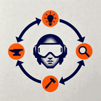
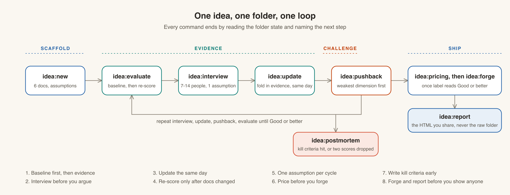

<p align="center">
  
</p>

<p align="center"><em>Turn a raw idea into a validated, investor-ready concept.</em></p>

<p align="center">
  
  
</p>

---

You start with an idea. The copilot guides a loop of testing, scoring, and improving until the idea is solid — or killed.

<p align="center">
  
</p>

## Install

Active next session.

<h3>
  
  Claude Code
</h3>

```bash
claude plugin marketplace add kaminskypavel/ideation-copilot
claude plugin install ideation-copilot@ideation-copilot
```

Then `/idea:new`, `/idea:evaluate`, `/idea:pushback`, …

<h3>
  
  Codex
</h3>

```bash
codex plugin marketplace add kaminskypavel/ideation-copilot
codex plugin add ideation-copilot@ideation-copilot
```

Prefix is `@`, not `/` — `@idea:new`.

<h3>
  
  Pi
</h3>

```bash
pi install git:github.com/kaminskypavel/ideation-copilot
```

`/idea:new` or just ask. Skills load from the package; no extra config.

<h3>
  
  Anything else
</h3>

Drop the folders in [`plugins/ideation-copilot/skills/`](plugins/ideation-copilot/skills/) into the harness skills dir. One `SKILL.md` each, no moving parts.

## Commands

| Command | Purpose |
|---|---|
| `idea:new [name "description"]` | Scaffold a new idea with 6 structured docs |
| `idea:evaluate [idea-name] [vc\|market\|yc]` | Score with parallel agents (all by default, or pick one) |
| `idea:pushback [idea-name]` | Conversational stress-test with web research |
| `idea:update [idea-name]` | Add new info to your docs (interviews, data, team changes) |
| `idea:forge [idea-name]` | Synthesize everything into a consolidated summary |
| `idea:postmortem [idea-name]` | Structured debrief when you kill an idea |
| `idea:setup` | Check & configure optional integrations (Exa, etc.) |

### Step 1: Pitch your idea

```bash
idea:new pawguard "Smart collar that detects early signs of illness in dogs using biometrics"
```

Scaffolds 6 structured docs (overview, brainstorm, lean canvas, assumptions, PMF strategy, experiments). You fill in what you know.

### Step 2: Get scored

```bash
idea:evaluate pawguard
```

Three agents run **in parallel** when the harness can (Claude Agent tool, Pi subagents); otherwise sequential in-session. Same scoring either way.

| Agent | What it asks | Dimensions |
|---|---|---|
| **VC** | "Is this investable?" | Team, Timing, TAM, Technology, Moat, Business Model, GTM, Traction |
| **Market Analyst** | "Is the market real?" | Market Size, Competitive Landscape, Timing & Tailwinds, Customer Access, Regulatory Risk |
| **YC Founder-Fit** | "Should YOU start this?" | Problem Acuteness, Personal Demand, Successful Proxies, Commitment, Scalability, Idea Space Fertility |

Combined score (0-100), deal-breakers flagged, weakest dimension first. Agents use web research — TAM claims, competitors, timing.

Single agent: `idea:evaluate pawguard vc` or `market` or `yc`

### Step 3: Stress-test through dialogue

```bash
idea:pushback pawguard
```

An adversarial sparring partner breaks the idea into testable claims and challenges each one. You defend, clarify, or concede. Named reasoning tools (inversion, base rate, pre-mortem) plus web research.

### Step 4: Fix what's weak

```bash
idea:update pawguard
```

Low scores often mean docs are incomplete, not that the idea is bad. Add team background, interview results, experiment outcomes, market data.

### Step 5: Repeat, then synthesize

Run evaluate and pushback again. Scores should improve. Keep iterating until you're confident — or the evidence says pivot.

```bash
idea:forge pawguard
```

Score trajectory, what's validated vs still assumed, key pivots, pitch-ready summary.

## What's In an Idea Folder

Each idea lives in `ideas/YYYY-MM-DD-idea-name/`:

**You write these:**

| File | What goes in it |
|---|---|
| `00-overview.md` | Problem, insight, solution, target customer |
| `01-brainstorm.md` | Problem/solution space exploration |
| `02-lean-canvas.md` | Lean Canvas — UVP, channels, revenue, costs |
| `03-assumptions.md` | Riskiest assumptions ranked, with evidence tracking |
| `04-pmf-strategy.md` | PMF ladder, go-to-market, milestones |
| `05-experiments.md` | Experiment backlog, results, pivot/persevere decisions |

**The copilot creates these:**

| File | What it contains |
|---|---|
| `evaluation-*.md` | Scored reports with YAML frontmatter (machine-readable) |
| `pushback-session-*.md` | Sparring scorecards with claim verdicts |
| `pushback-predictions-*.md` | Falsifiable, time-bound predictions |
| `forge-*.md` | Consolidated synthesis with score trajectory |

## Enhanced Research (Optional)

Works out of the box with built-in web search. For richer market and competitor research, add [Exa](https://exa.ai) (free tier: 1,000 requests/month).

1. Get an API key at [exa.ai](https://exa.ai).
2. Export it: `export EXA_API_KEY=…` (or put it in the harness env — `~/.claude/settings.json`, Codex config, or Pi MCP/env).
3. Run `idea:setup`. It detects the key and prints the one-liner for this harness's MCP.

| Without Exa | With Exa |
|---|---|
| Generic web search for all research | Category-specific search: `company`, `news`, `financial report`, `research paper`, `linkedin profile` |
| Works fine — this is the default | More targeted competitor data, funding info, SEC filings, trend analysis |

If Exa is unavailable, agents fall back to web search. Zero disruption.

## Built With

Community skills powering the workflow:

- **lean-startup** — Build-Measure-Learn methodology
- **lean-canvas** — Lean Canvas generation
- **pmf-strategy** — PMF validation framework
- **product-management** — Founder-PM toolkit
- **brainstorm-ideas-new** — PM/Designer/Engineer ideation

`bun test` · MIT
